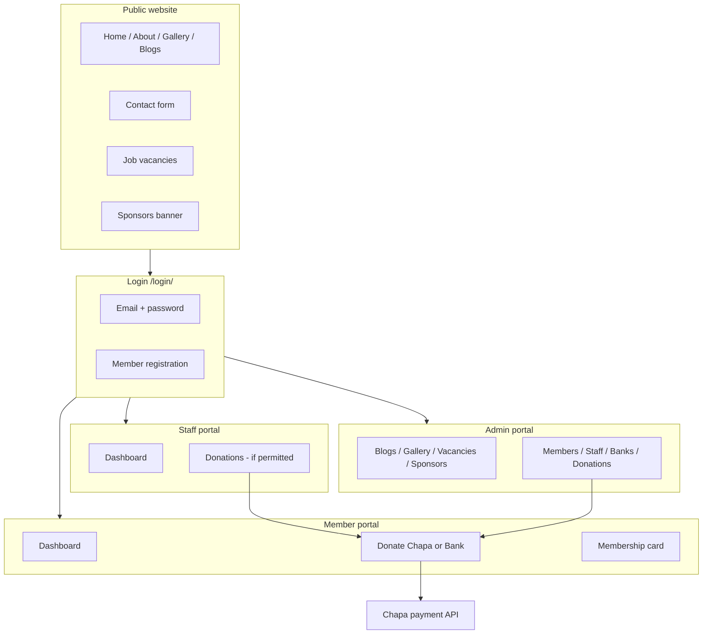
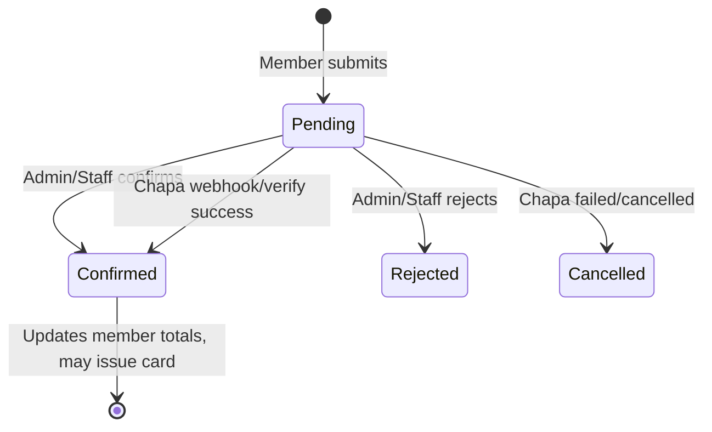

# Gachana Charity Association — Full Functionality Guide

Django web application for **Gachana Charity Association** (Dire Dawa, Ethiopia).  
Production site: [gachanacharity.com](https://www.gachanacharity.com)

This document describes every major feature from the public website through the member, staff, and admin portals.

---

## Table of contents

1. [System overview](#1-system-overview)
2. [User roles & access](#2-user-roles--access)
3. [Public website](#3-public-website)
4. [Authentication & accounts](#4-authentication--accounts)
5. [Member portal](#5-member-portal)
6. [Staff portal](#6-staff-portal)
7. [Admin portal](#7-admin-portal)
8. [Donations & payments](#8-donations--payments)
9. [Email & notifications](#9-email--notifications)
10. [Data models](#10-data-models)
11. [URL reference](#11-url-reference)
12. [Local setup](#12-local-setup)

---

## 1. System overview



**Tech stack:** Django 5.x, SQLite (dev), CKEditor, Pillow, Chapa payments, SMTP email.

**Project layout:**

| Path | Purpose |
|------|---------|
| `gachana_NGO/` | Django project settings, WSGI |
| `gachana_app/` | Models, views, templates, migrations |
| `static/` | Public CSS, JS, images |
| `gachana_app/static/images/` | Uploaded media (blogs, gallery, sponsors, proofs) |

---

## 2. User roles & access

| Role | Login redirect | Can access |
|------|----------------|------------|
| **Member** | `/portal/member/` | Own profile, donations, membership card, donate |
| **Staff** | `/portal/staff/` | Profile, ID card; donations **only if** `can_manage_donations` is enabled |
| **Admin** | `/portal/admin/` | Full portal: members, staff, content, donations, settings |

- Admins and superusers bypass role checks on admin-only views.
- Staff without donation permission do **not** see donation management in the sidebar.
- Decorators: `role_required`, `donation_manager_required` (`gachana_app/decorators.py`).

---

## 3. Public website

All public pages use the shared navbar (`components/navbar.html`) and footer.

### 3.1 Home (`/`)

- Image carousel with mission messaging.
- About tabs (About / Mission / Vision).
- Services / impact sections.
- Testimonials.
- **Sponsors & partners** section (dynamic, from database).
- Latest **3 published blog posts**.

### 3.2 About (`/about`)

- Organization story, mission, values, team-style content.
- Embedded gallery preview (filterable by category).
- Testimonials.
- **Sponsors section** (same component as home).

### 3.3 Gallery (`/gallery`)

- Photos grouped by **gallery categories** (managed in admin).
- Client-side filter by category.
- AJAX endpoint: `/gallery/fetch/<category>/` returns JSON of images for a category slug or `all`.

### 3.4 Blogs (`/blogs`)

- Lists all **published** blog posts (`status = 1`).
- Cards show featured image or video thumbnail (with play overlay if video + cover).

### 3.5 Blog detail (`/blog/<slug>/`)

- SEO-friendly slug URLs (auto-generated from title).
- Legacy `/blog_details/<id>/` redirects permanently to slug URL.
- Rich HTML content (CKEditor).
- Featured media: image **or** video (with optional cover/poster image).
- Sidebar: categories, recent posts.
- **Comments:** visitors can submit name, email, message (stored in `Comment` model).

### 3.6 Blog by category (`/blogs/category/<id>/`)

- Filtered list of published posts for one category.
- Category sidebar with post counts.

### 3.7 Contact (`/contact`)

- Form: name, email, subject, message.
- AJAX submit → JSON response + success modal.
- **Rate limit:** max **3 messages per email per day**.
- Message saved to database; optional admin/user emails sent in background (failure does not block success).
- Admin reads messages at `/contact_messages/`.

### 3.8 Our work (`/our_work`)

- Programs and impact content.
- Latest 3 blog posts embedded.

### 3.9 Climate advocacy (`/climate`)

- Static informational page.

### 3.10 Why donate / sustainability (`/why_donate`, `/donate`)

- Informational donation pages (public).
- Actual **online giving** for members is in the member portal (`/portal/member/donate/`).

### 3.11 Vacancies (`/vacancy`, `/vacancy_details/<id>/`)

- Lists job openings from database.
- Detail page: description, department, type, location, salary, deadline, apply link.

### 3.12 Sponsors banner (component)

Included on **Home** and **About** via `components/sponsors_section.html`.

- Shows sponsors that are **active** and **within visibility dates**.
- Card tiers: Platinum (wider on desktop), Gold, Silver, Partner.
- Logo, name, tagline, optional website link.
- Hidden automatically when visibility period expires (unless **Lifetime**).

### 3.13 404

- Custom `404.html` for missing pages.

---

## 4. Authentication & accounts

### 4.1 Login (`/login/`)

- Email + password (authenticates via linked username).
- After login, redirects by role:
  - Admin → `/portal/admin/`
  - Staff → `/portal/staff/`
  - Member → `/portal/member/`

### 4.2 Member registration

- On login page: `?register=1` or signup tab.
- Creates `User` (role: member) + `MemberProfile` with auto ID `GCA-#####`.
- Logs in immediately after signup.

### 4.3 Password reset

- `/password-reset/` — request link by email.
- `/reset-password/<uid>/<token>/` — set new password.
- Uses `SITE_URL` in email link.

### 4.4 Logout (`/logout/`)

- Ends session, redirects to login.

### 4.5 Legacy routes

- `/signin` → redirects to `/login/`
- `/admin_dashboard` → redirects to `/portal/admin/`

---

## 5. Member portal

Base path: `/portal/member/`

### 5.1 Dashboard

- Membership ID and profile summary.
- Personal confirmed donation total.
- Pending donation count.
- **Community giving goal** progress (site-wide target from admin settings).
- Recent donations list.

### 5.2 Donate (`/portal/member/donate/`)

Two payment methods (tabbed UI):

| Method | Flow |
|--------|------|
| **Chapa** | Enter amount → redirect to Chapa checkout → callback confirms donation |
| **Bank transfer** | Select bank, amount, reference, upload proof image → status **Pending** until staff/admin confirms |

- Banks shown are active records from admin **Bank accounts**.
- If no banks configured, manual tab shows a notice.

### 5.3 My donations (`/portal/member/donations/`)

- History of all donations with status badges (pending, confirmed, rejected, cancelled).

### 5.4 Profile (`/portal/member/profile/`)

- Update name, phone, address, profile photo.

### 5.5 Membership card (`/portal/member/card/`)

- Digital membership card (issued after **first confirmed donation**).
- Shows membership ID, name, photo.

---

## 6. Staff portal

Base path: `/portal/staff/`

### 6.1 Dashboard

- Staff overview and quick links.

### 6.2 Profile (`/portal/staff/profile/`)

- Update contact details and photo.

### 6.3 Staff ID card (`/portal/staff/id-card/`)

- Printable staff ID with employee ID (`GCS-#####`), designation, department.

### 6.4 Donation management (optional)

If admin enables **Can manage donations** on the staff profile:

- Access `/portal/donations/` (staff-themed layout).
- Filter: All / Pending / Confirmed / Rejected.
- View manual payment **proof** (image modal).
- **Confirm** or **Reject** pending donations.

Staff without permission do not see donation links.

---

## 7. Admin portal

Two areas share the admin shell (`portal/admin/base_admin.html`):

1. **Operations portal** — `/portal/admin/…`
2. **Website content CMS** — top-level routes like `/blog_list`, `/sponsors/`

### 7.1 Admin dashboard (`/portal/admin/`)

- KPIs: members, donations, pending reviews, staff count.
- Community giving goal widget + edit link.
- Charts: donation status, monthly donations, member growth, content counts.
- Quick actions: new blog, vacancy, gallery, sponsors, donations, etc.

### 7.2 Member management (`/portal/admin/members/`)

- Paginated, searchable member list.
- Filters: membership card issued/pending, donation amount ranges.
- Stats: total members, cards issued, total donated.
- Member detail page per user.

### 7.3 Member settings (`/portal/admin/member-settings/`)

- **Annual giving goal** (ETB) — community-wide target shown to all members.
- Headline and message text for the goal banner.

### 7.4 Bank accounts (`/portal/admin/banks/`)

- CRUD for `DonationBank` (name, account name/number, branch, sort order, active).
- Controls which banks appear on member donate form.

### 7.5 Staff management (`/portal/admin/staff/`)

- Create/edit staff users and profiles.
- Assign **designation**, department, employee ID.
- Toggle **active** and **can manage donations**.
- Staff detail + printable admin ID card view.

### 7.6 Donations (`/portal/donations/`)

Same capabilities as staff donation managers, plus admin layout.

- Confirm → updates member totals, may **issue membership card**.
- Reject → marks donation rejected.

### 7.7 Website content — Blogs

| URL | Action |
|-----|--------|
| `/blog_list` | List, search posts |
| `/create_blogs` | Create (AJAX + progress bar for large video uploads) |
| `/edit_blog/<id>/` | Edit |
| `/delete_blog/<id>/` | Delete |
| `/blog_categories/` | CRUD blog categories |

**Blog features:**

- Title, slug (auto), categories (many), rich description.
- Published / unpublished.
- Media type: **Image** (banner) or **Video** (file + optional cover image).
- Video upload shows progress bar; XHR JSON response on create.

### 7.8 Website content — Vacancies

| URL | Action |
|-----|--------|
| `/vacancy_list` | List, search |
| `/create_vacancy` | Create |
| `/edit_vacancy/<id>/` | Edit |
| `/delete_vacancy/<id>/` | Delete |

Fields: title, department, experience, position, job type, rich description, location, salary, banner, status, external apply link, deadline.

### 7.9 Website content — Gallery

| URL | Action |
|-----|--------|
| `/gallery_list` | Grid list, filter by category |
| `/gallery_categories/` | CRUD gallery categories (slug, sort, active) |
| `/create_gallery` | Upload image |
| `/edit_gallery/<id>/` | Edit |
| `/delete_gallery/<id>/` | Delete |

### 7.10 Website content — Sponsors

| URL | Action |
|-----|--------|
| `/sponsors/` | List sponsors, filter by tier |
| `/sponsors/add/` | Add sponsor |
| `/sponsors/<id>/edit/` | Edit |
| `/sponsors/<id>/delete/` | Delete |

Fields: name, logo, tagline, website URL, tier, **visibility duration** (1 week → lifetime or custom end date), sort order, active flag.

### 7.11 Website content — Contact inbox

| URL | Action |
|-----|--------|
| `/contact_messages/` | List/search messages from public form |
| `/contact_messages/<id>/` | Read full message, reply via mailto |
| `/contact_messages/<id>/delete/` | Delete |

### 7.12 Admin profile

| URL | Action |
|-----|--------|
| `/admin_page/profile` | View profile |
| `/admin_page/edit_profile` | Edit name, photo, etc. |

---

## 8. Donations & payments

### 8.1 Donation lifecycle



### 8.2 Manual (bank transfer)

1. Member selects bank, enters amount & reference, uploads proof.
2. Donation created as **Pending**.
3. Manager views proof at `/portal/donations/<id>/proof/`.
4. Confirm → `confirm_donation()` updates status, member `total_donated`, may set `card_issued_at`.

### 8.3 Chapa (online)

1. Member enters amount → `initialize_payment()` via Chapa API.
2. Redirect to Chapa checkout.
3. **Callback** (`/payments/chapa/callback/`) — webhook verifies signature, confirms donation.
4. **Return URL** (`/payments/chapa/return/<tx_ref>/`) — user lands back after payment.

**Environment variables:**

- `CHAPA_SECRET_KEY`
- `CHAPA_PUBLIC_KEY`
- `CHAPA_WEBHOOK_SECRET` (optional; falls back to secret key)

### 8.4 Membership card rules

- Issued automatically when member has at least one **confirmed** donation and card not yet issued.
- ID format: `GCA-00001` (sequential).

---

## 9. Email & notifications

| Trigger | Recipients | Notes |
|---------|------------|-------|
| Contact form | Admin + sender | Background thread; SMTP failure does not block form |
| Password reset | User | Link with `SITE_URL` |
| Blog/contact (legacy) | — | Contact uses `send_contact_notification_emails()` in `utils.py` |

SMTP configured in `gachana_NGO/settings.py` (`EMAIL_HOST`, etc.).

---

## 10. Data models

| Model | Purpose |
|-------|---------|
| `User` | Custom user: role, phone, address, photo |
| `MemberProfile` | Membership ID, totals, card issued date |
| `StaffProfile` | Employee ID, designation, department, donation permission |
| `StaffDesignation` | Job titles for staff |
| `PortalSettings` | Singleton: annual giving goal, headline, message |
| `DonationBank` | Bank accounts for manual transfers |
| `Donation` | Amount, method, status, proof, Chapa refs |
| `Category` | Blog categories |
| `Blog` | Posts: slug, media type, image/video, status |
| `Comment` | Blog comments |
| `GalleryCategory` | Gallery filters (slug, sort, active) |
| `Gallery` | Gallery images |
| `Vacancy` | Job listings |
| `Sponsor` | Partner cards with tier & visibility |
| `Contact` | Contact form submissions |

---

## 11. URL reference

### Public

| URL | Name |
|-----|------|
| `/` | home |
| `/about` | about |
| `/gallery` | gallery |
| `/blogs` | blogs |
| `/blog/<slug>/` | blog_details |
| `/blogs/category/<id>/` | blog_by_category_with_id |
| `/contact` | contact |
| `/climate` | climate |
| `/our_work` | our_work |
| `/why_donate` | why_donate |
| `/donate` | donate |
| `/vacancy` | vacancy |
| `/vacancy_details/<id>/` | vacancy_details |

### Auth

| URL | Name |
|-----|------|
| `/login/` | login |
| `/logout/` | logout |
| `/password-reset/` | password_reset_request |
| `/reset-password/<uid>/<token>/` | password_reset_confirm |

### Member

| URL | Name |
|-----|------|
| `/portal/member/` | member_dashboard |
| `/portal/member/donate/` | member_donate |
| `/portal/member/donations/` | member_donations |
| `/portal/member/profile/` | member_profile |
| `/portal/member/card/` | member_card |

### Staff

| URL | Name |
|-----|------|
| `/portal/staff/` | staff_dashboard |
| `/portal/staff/profile/` | staff_profile |
| `/portal/staff/id-card/` | staff_id_card |

### Admin operations

| URL | Name |
|-----|------|
| `/portal/admin/` | portal_admin_dashboard |
| `/portal/admin/members/` | portal_manage_members |
| `/portal/admin/member-settings/` | portal_admin_member_settings |
| `/portal/admin/banks/` | portal_admin_banks |
| `/portal/admin/staff/` | portal_manage_staff |
| `/portal/donations/` | portal_donation_list |

### Admin content

| URL | Name |
|-----|------|
| `/blog_list` | blog_list |
| `/blog_categories/` | blog_category_list |
| `/vacancy_list` | vacancy_list |
| `/gallery_list` | gallery_list |
| `/gallery_categories/` | gallery_category_list |
| `/sponsors/` | sponsor_list |
| `/contact_messages/` | contact_message_list |

---

## 12. Local setup

```bash
# Clone and enter project
cd gachana

# Virtual environment (recommended)
python -m venv venv
venv\Scripts\activate        # Windows
# source venv/bin/activate   # macOS/Linux

pip install -r requirements.txt

# Database
python manage.py migrate

# Create admin user (Django shell or createsuperuser)
python manage.py createsuperuser
# Then set user.role = 'admin' in shell if needed

# Run server
python manage.py runserver
```

**Optional environment variables:**

| Variable | Purpose |
|----------|---------|
| `DJANGO_DEBUG` | `0` in production |
| `SITE_URL` | Base URL for password reset emails |
| `CHAPA_SECRET_KEY` | Chapa payments |
| `CHAPA_PUBLIC_KEY` | Chapa payments |
| `CHAPA_WEBHOOK_SECRET` | Webhook signature verification |

**Migrations:** Apply through `0025_backfill_sponsor_visible_until` for full schema (staff permissions, gallery categories, blog video/slug, sponsors visibility, etc.).

---

## Typical workflows (start to end)

### A. Visitor reads a blog post

1. Opens `/blogs` → clicks post → `/blog/<slug>/`.
2. Reads content; optional comment submitted → stored and shown on page.

### B. Visitor contacts the organization

1. Opens `/contact`, fills form.
2. Server validates, rate-limits, saves `Contact`, returns JSON success.
3. Admin reviews at `/contact_messages/`.

### C. New member joins and donates

1. `/login/?register=1` → signup → `GCA-#####` assigned.
2. `/portal/member/donate/` → Chapa or bank transfer.
3. If manual: admin confirms at `/portal/donations/`.
4. Membership card unlocks at `/portal/member/card/`.

### D. Admin publishes content

1. Login as admin → **Blogs** → **New blog**.
2. Set categories, image or video, publish.
3. Post appears on `/blogs` and home page teaser.

### E. Admin showcases a sponsor

1. **Sponsors** → **Add sponsor** → logo, tier, visibility (e.g. 1 year).
2. Card appears on home/about until end date or manual deactivation.

---

*Last updated: reflects codebase through migration `0025` (sponsors, contact inbox, blog video, portal donations, gallery categories).*
